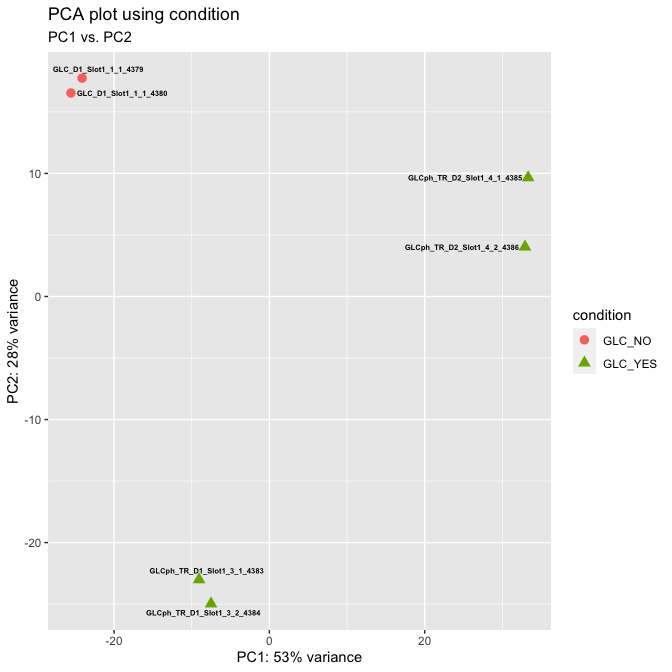
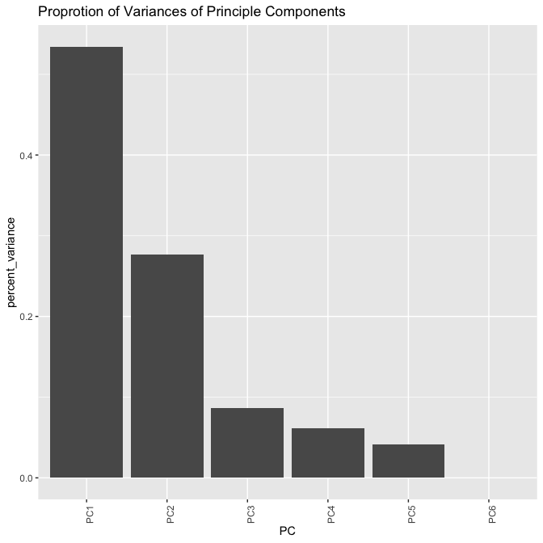
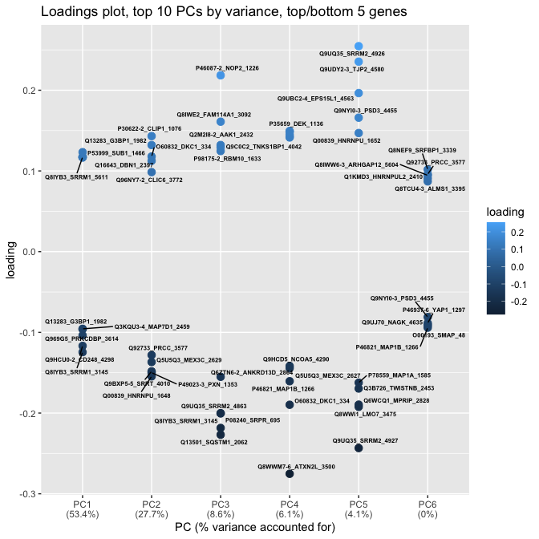
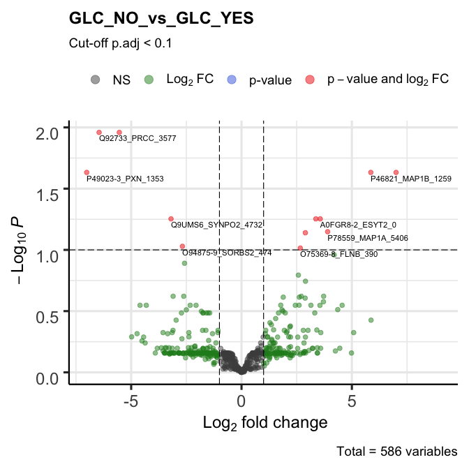
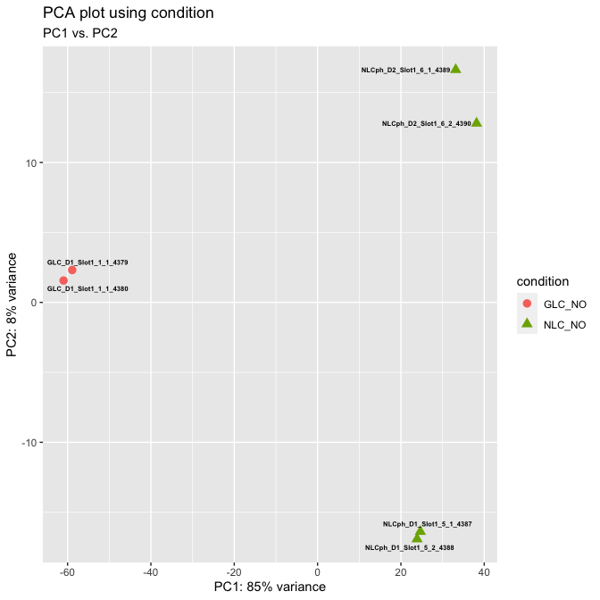
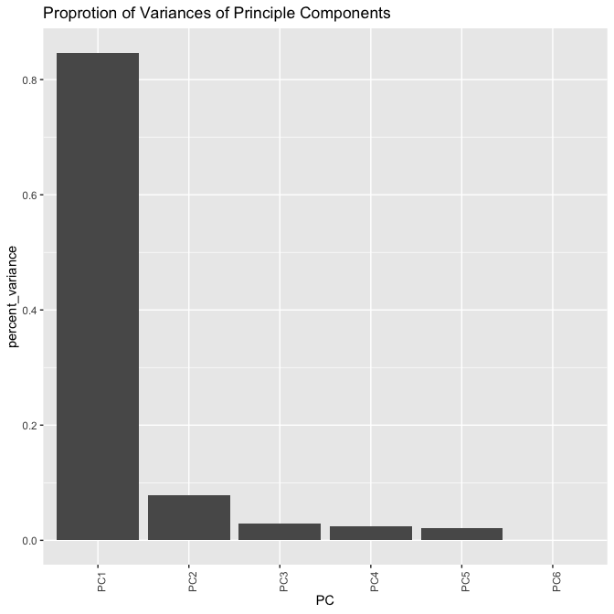
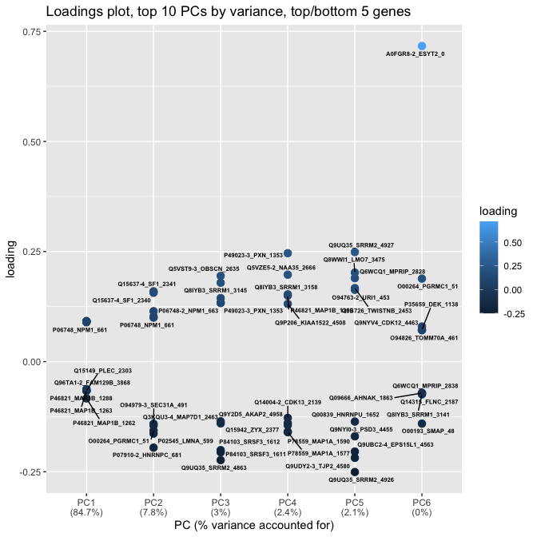
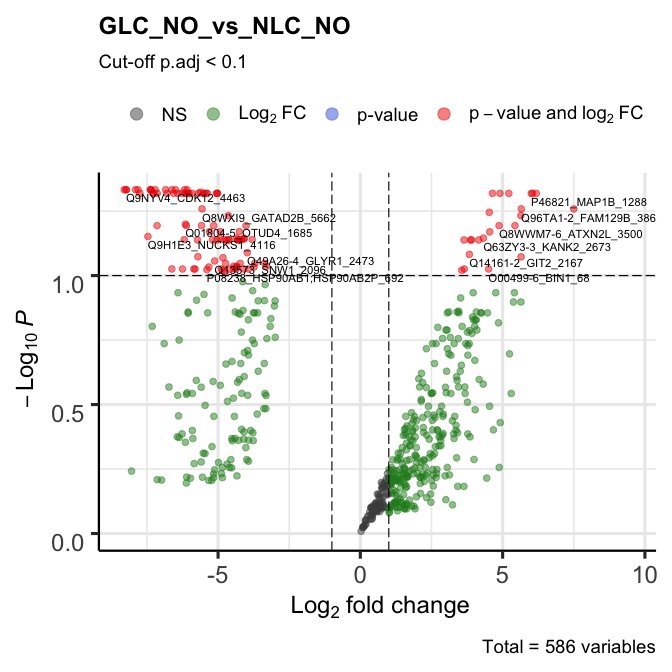

Phosphoproteomics DE Analysis
================
BM
8/9/2021

    ## [1] "../DEP_output/cell_line_metformin_excl_NLC/GLC_metformin.cell_line_metformin_excl_NLC.RData"

<!-- --><!-- -->

    ## Warning: ggrepel: 7 unlabeled data points (too many overlaps). Consider
    ## increasing max.overlaps

<!-- --><!-- -->

    ## [1] "../DEP_output/cell_line_metformin_excl_YES/GLC_NLC.cell_line_metformin_excl_YES.RData"

<!-- --><!-- -->

    ## Warning: ggrepel: 9 unlabeled data points (too many overlaps). Consider
    ## increasing max.overlaps

<!-- --><!-- -->

    ## [[1]]

<!-- -->

    ## 
    ## [[2]]

<!-- -->
