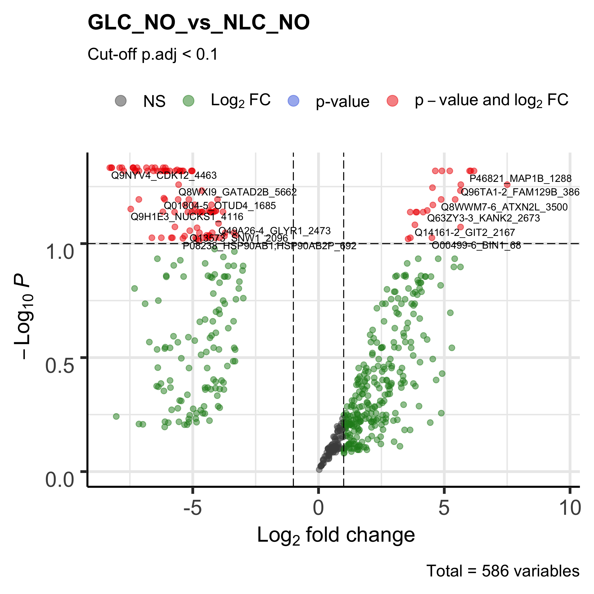

# Glaucoma Cell-line Data Analysis
## including RNAseq, Proteomics and Phosphoproteomics

### Phosphoproteomics Analysis
```
Glaucoma (GLC) Untreated vs. Metformin Treated Cells
```

[Download PCA PDF](DEP_output/cell_line_metformin_excl_NLC/GLC_metformin.PCAse.cell_line_metformin_excl_NLC.pdf)

[Download Volcano PDF](DEP_output/cell_line_metformin_excl_NLC/GLC_metformin.enh_volcanos.cell_line_metformin_excl_NLC.pdf)
```
Glaucoma (GLC) vs. Normal lamina cribrosa (NLC) Cells
```

[Download PCA PDF](DEP_output/cell_line_metformin_excl_NLC/GLC_metformin.PCAse.cell_line_metformin_excl_NLC.pdf)

[Download Volcano PDF](DEP_output/cell_line_metformin_excl_YES/GLC_NLC.enh_volcanos.cell_line_metformin_excl_YES.pdf)
