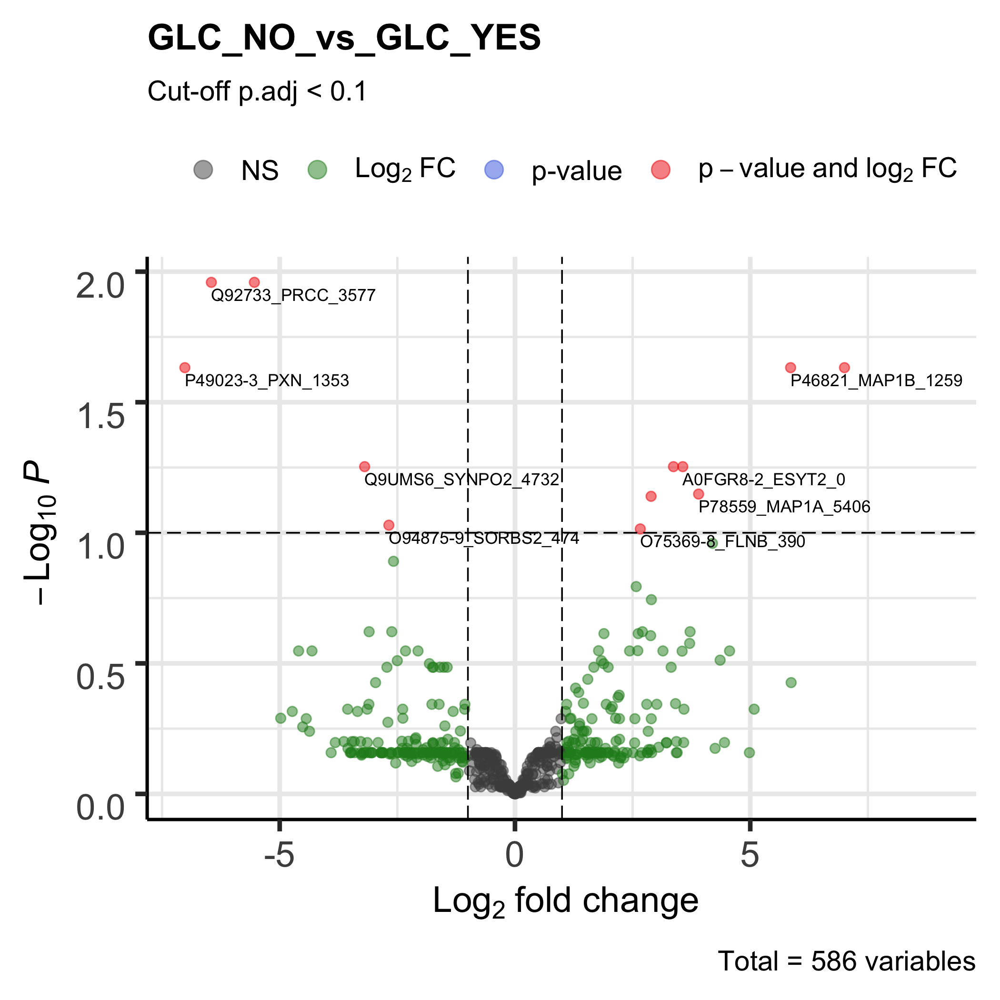

# Glaucoma Cell-line Data Analysis
## including RNAseq, Proteomics and Phosphoproteomics

### Phosphoproteomics Analysis
```
Glaucoma (GLC) Untreated vs. Metformin Treated Cells
```



```
Glaucoma (GLC) vs. Normal lamina cribrosa (NLC) Cells
```


